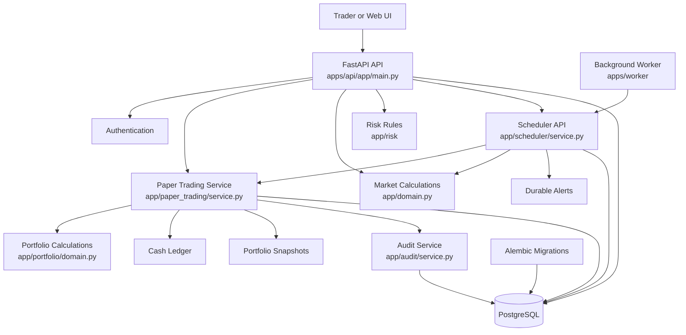
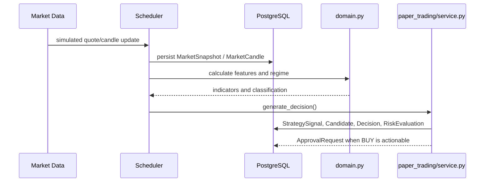
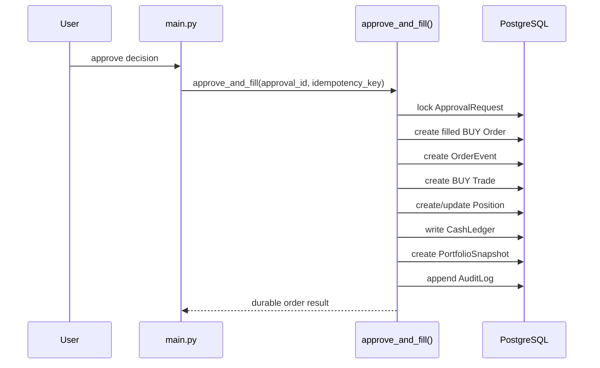
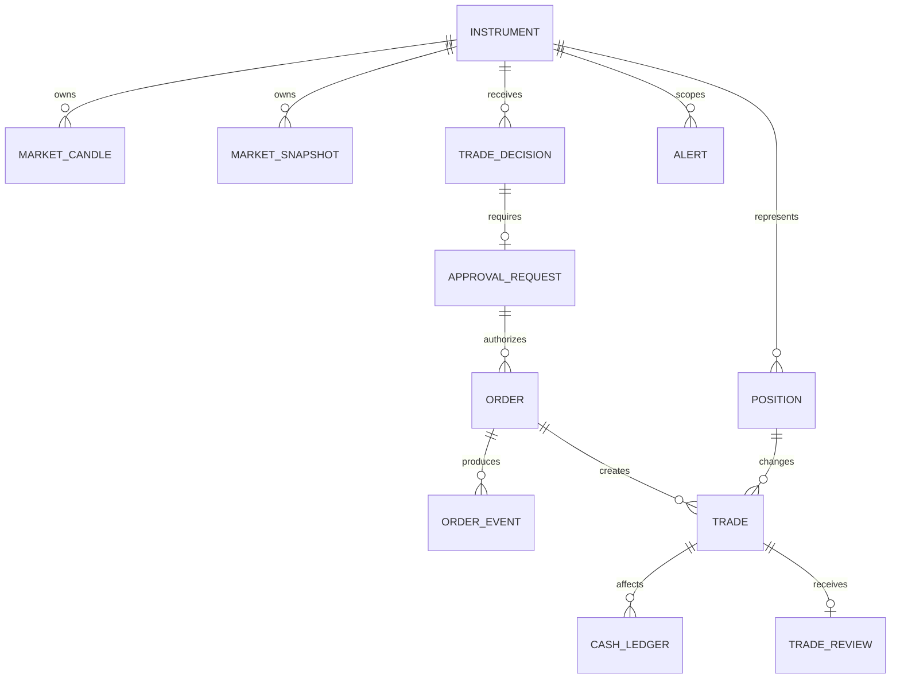

# Market AI — Architecture Guide

This document explains what the application does, why it exists, how its pieces connect, and how to read the code.

## 1. What problem does this application solve?

Market AI is a paper-trading platform for testing a durable, auditable trading workflow without sending real broker orders.

It models the complete lifecycle of a trade:

```text
market data
  → analysis
  → trading decision
  → risk checks
  → human approval
  → paper order and fill
  → position and cash ledger
  → automatic stop/target or EOD exit
  → audit and reconciliation
```

The main goal is not simply to show a BUY/SELL recommendation. The goal is to prove that every financial effect is persisted consistently and can survive retries, restarts, duplicate jobs, and failed transactions.

Live broker trading is intentionally disabled:

```text
LIVE_TRADING_ENABLED=false
```

## 2. System at a glance



## 3. The application in one sentence

The API and worker create a durable paper-trading state machine where market data produces decisions, approved decisions produce financial records, and every exit is atomic, auditable, and reconciled.

## 4. Repository map

```text
apps/
├── api/
│   ├── app/
│   │   ├── main.py                 HTTP endpoints and request handling
│   │   ├── config.py               environment and runtime settings
│   │   ├── domain.py               pure candle/features/regime calculations
│   │   ├── common/
│   │   │   ├── db.py               SQLAlchemy engine and sessions
│   │   │   ├── models.py           PostgreSQL models
│   │   │   └── test_database.py    disposable DB safety checks
│   │   ├── paper_trading/
│   │   │   ├── service.py          core trading workflows
│   │   │   └── daily_pnl.py         daily P&L calculation
│   │   ├── portfolio/domain.py     pure P&L and averaging calculations
│   │   ├── risk/                    risk configuration and evaluation
│   │   ├── scheduler/               durable background jobs
│   │   └── audit/service.py         append-only audit events
│   ├── alembic/                     database migrations
│   └── tests/                       unit and PostgreSQL integration tests
├── worker/worker.py                background polling worker
└── web/                             frontend application
```

## 5. Core business flow

### 5.1 Market data to decision



### 5.2 Approval to paper entry



### 5.3 Automatic exit

```mermaid
flowchart TD
    Source[Fresh quote or completed candle] --> Evaluate[STOP_TARGET_EVALUATION]
    Evaluate --> Stop{Stop touched?}
    Stop -->|yes| StopExit[STOP_LOSS_TRIGGERED]
    Stop -->|no| Target{Target touched?}
    Target -->|yes| TargetExit[TARGET_TRIGGERED]
    Target -->|no| Keep[Position remains open]
    StopExit --> Exit[exit_position()]
    TargetExit --> Exit
    Exit --> Sell[SELL order + event + trade]
    Sell --> Position[Update position]
    Position --> Effects[Ledger + snapshot + audit + review]
```

## 6. Main modules and their responsibilities

### `main.py` — transport layer

This file translates HTTP requests into service calls. It should not contain the financial calculations themselves.

Important endpoints:

| Endpoint | Function | Purpose |
|---|---|---|
| `GET /health` | `health()` | liveness check |
| `GET /readiness` | `readiness()` | database readiness |
| `GET /api/v1/scanner/results` | `scanner()` | show current scanner output |
| `POST /api/v1/decisions/generate` | `generate()` | create a decision |
| `POST /api/v1/approvals/{id}/approve` | `approve()` | approve and fill a BUY |
| `GET /api/v1/paper/positions` | `positions()` | list open positions |
| `POST /api/v1/paper/positions/{id}/exit` | `position_exit()` | manually exit a position |
| `GET /api/v1/paper/portfolio` | `get_portfolio()` | current portfolio state |
| `POST /api/v1/paper/reconcile` | `reconcile_api()` | verify financial consistency |
| `POST /api/v1/system/jobs/{type}/run` | `run_job_api()` | execute a durable job |
| `GET /api/v1/alerts` | `alerts()` | inspect durable alerts |

### `domain.py` — pure market logic

Key functions:

- `aggregate_candle(ticks)`: turns ticks into an OHLCV candle.
- `features(candles)`: computes VWAP, EMA, RSI, volume and data quality.
- `regime(candles)`: classifies the market regime.

This layer should be deterministic and database-independent.

### `paper_trading/service.py` — financial core

Read this file in this order:

1. `cash_balance()`
2. `setting()`
3. `add_ledger()`
4. `snapshot()`
5. `seed()`
6. `candles_for()`
7. `scan()`
8. `generate_decision()`
9. `approve_and_fill()`
10. `exit_position()`
11. `portfolio()`
12. `reconcile()`

The two most important functions are:

#### `approve_and_fill()`

Creates the complete BUY-side financial lifecycle.

#### `exit_position()`

Creates the complete SELL-side financial lifecycle and is reused by manual, stop, target, and EOD exits.

### `scheduler/service.py` — durable orchestration

The scheduler does not replace the trading service. It decides when a workflow should run, then calls the existing services.

Important jobs:

| Job | Responsibility |
|---|---|
| `SIMULATED_PRICE_UPDATE` | create deterministic market snapshots |
| `CANDLE_FINALISATION` | turn snapshots into completed candles |
| `FEATURE_REFRESH` | persist feature snapshots |
| `MARKET_REGIME_REFRESH` | persist regime classifications |
| `DECISION_SCAN` | generate decisions for eligible instruments |
| `STOP_TARGET_EVALUATION` | evaluate automatic stop/target exits |
| `EOD_POSITION_EXIT` | close eligible intraday positions at EOD |
| `STALE_DATA_CHECK` | create/update/resolve data alerts |
| `TRADE_REVIEW_CREATION` | create reviews for completed trades |

### `models.py` — durable state

Important records:

```text
Instrument
MarketCandle / MarketSnapshot
TradeDecision / ApprovalRequest
Order / OrderEvent / Trade
Position
CashLedger
PortfolioSnapshot
Alert
AuditLog
ScheduledJob / JobRun
TradeReview
```

## 7. Data relationships



## 8. Transaction model

Financial operations are designed as atomic units:

```text
begin transaction
  create order
  create order event
  create trade
  update position
  write ledger entries
  create snapshot
  write audit records
commit
```

EOD retry attempts use a nested savepoint:

```text
outer job transaction
  ├── attempt 1 savepoint → failure → rollback savepoint
  ├── attempt 2 savepoint → failure → rollback savepoint
  └── attempt 3 savepoint → success → commit
```

If all attempts fail, the financial rows are rolled back and one durable `EOD_EXIT_FAILED` alert is created or updated.

## 9. Identity and idempotency

There are three deliberately separate identities:

### Job execution identity

```text
<job_type>:<evaluation_timestamp>:<uuid>
```

Every execution gets a unique `JobRun`.

### Financial identity

For EOD exits, the logical identity is based on:

```text
position + IST trading date + EOD_FORCED_EXIT
```

It remains stable across retries and repeated runs.

### Alert identity

Failure alerts use a stable key based on:

```text
position + instrument + IST trading date + workflow
```

The unique JobRun suffix is not used for financial idempotency or alert deduplication.

## 10. How to trace a feature

Use this workflow when learning any behavior:

```text
HTTP endpoint
  ↓
service function
  ↓
domain calculation or database lookup
  ↓
financial mutation
  ↓
ledger / snapshot / audit
  ↓
API response
```

For a manual exit, start here:

```text
main.position_exit()
  → service.exit_position()
  → Order
  → OrderEvent
  → Trade
  → Position
  → CashLedger
  → PortfolioSnapshot
  → AuditLog
```

For an automatic EOD exit:

```text
main.run_job_api()
  → scheduler.run_job()
  → EOD policy checks
  → market-data validation
  → service.exit_position()
  → financial records
```

## 11. Recommended reading sequence

1. Read `main.py` endpoints.
2. Read `common/db.py` to understand sessions.
3. Read `common/models.py` to understand persistent state.
4. Read `domain.py` for market calculations.
5. Read `paper_trading/service.py` for BUY and SELL transactions.
6. Read `portfolio/domain.py` for P&L math.
7. Read `risk/domain.py` and `risk/config_service.py` for risk behavior.
8. Read `scheduler/eod_policy.py`.
9. Read `scheduler/service.py` for background orchestration.
10. Read integration tests as executable architecture documentation.

## 12. Verification map

The current integration tests document the durable behavior:

```text
test_automatic_stop_target.py  → quote/candle stop and target behavior
test_eod_exits.py               → EOD eligibility and missing/stale data
test_eod_retry.py               → savepoints, retries, rollback, recovery
test_stale_data_alerts.py       → alert creation, deduplication, resolution
test_vertical_slice.py          → end-to-end API lifecycle and reconciliation
```

The tests are useful because they assert database rows, not only HTTP responses or function return values.

## 13. Plain-English summary

A user or background job supplies market data. The system turns that data into analysis and a possible decision. A decision can require approval. Approval creates a paper BUY order, trade, position, cash movement, snapshot, and audit trail. Later, a scheduler watches the position for stop, target, or end-of-day conditions. An exit uses the same durable transaction path and creates the corresponding SELL-side records. If a job fails, savepoints prevent partial financial records. Alerts explain missing, stale, or failed operational conditions. Reconciliation checks that the resulting records still agree.

That is the central design: **a durable, auditable paper-trading workflow rather than an isolated signal generator.**
